Comptes 
==============================

Description 
-----------

Plugin qui permet la gestion (manuelle) de comptes bancaires. 

Configuration du plugin
========================

Dans la page de configuration du plugin, 1ère étape afin de le rendre fonctionel, il faut dans un premier temps activer le plugin.  

Une fois le plugin activé, ce dernier va automatiquement créer les tables nécessaires au bon fonctionnemnet du plugin.  

La page de configuration permet de configurer plusieurs types d'informations importantes:  
- La possibilité d'importer les catégories proposées par défaut afin d'éviter d'avoir à recréer un ensemble de catégories pour ceux que cela intéresse.  
C'est une sous partie de celles que j'utilise actuellement, libre à vous de modifier ensuite!  
Pour cela il faut cliquer sur le bouton "importer" mais attention, si vous avez déjà créé des catégories, cela peut poser soucis (pas de gestion avancée de conflit si des comptes sont déjà créés avec des opérations utilisant des catégories)

- Le nom des banques disponible à associer à un compte.  
Pour chaque banque, on peut associer un grand logo, un petit logo (pour le menu) et un nom. 

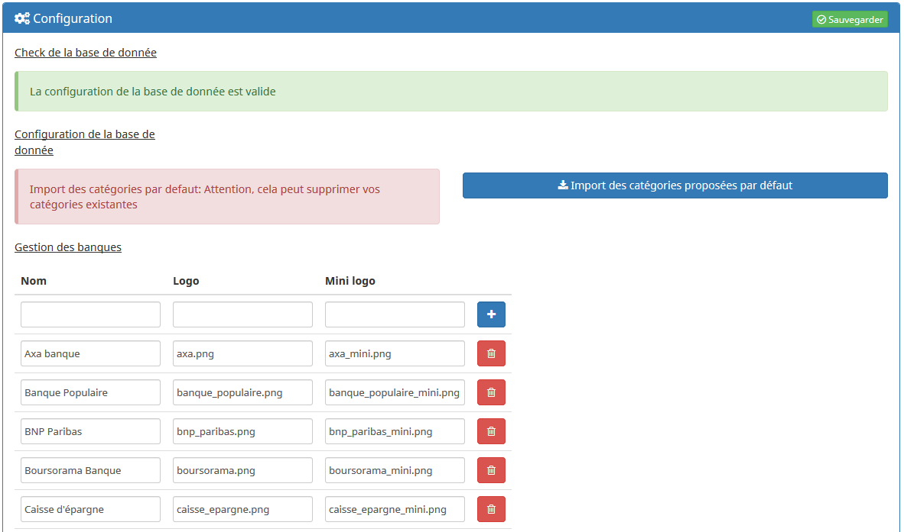

La 1ère ligne du tableau des banques permet d'ajouter une nouvelle banque.  

Les logos sont à mettre dans le répertoire "images/banques/" du plugin.  

La taille recommandée pour les logos est de 225 px * 225 px.  

La taille recommandée pour les mini logos est de 40 px * 40 px. 

La page de gestion du plugin 
=========
Rendez vous dans le menu *Plugins &gt; Organisation* pour retrouver le plugin.

Voici un aperçu de cette page avec plusieurs comptes créés: 

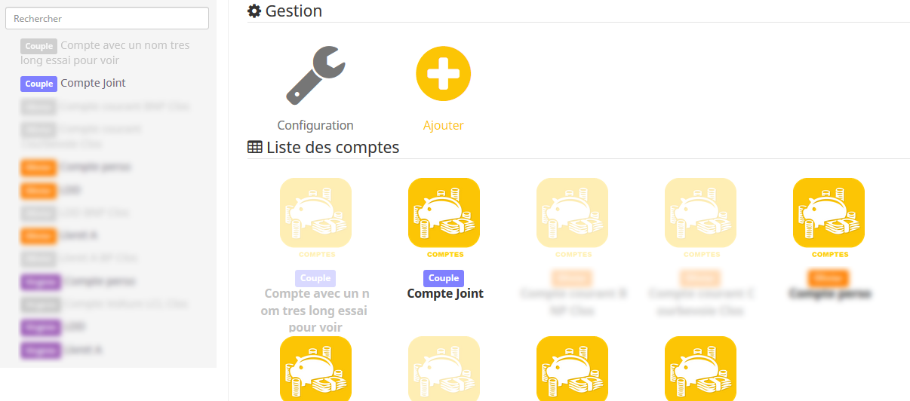

A gauche, on retrouve la liste des comptes déjà créés avec une barre de recherche. 

Sur la droite, tant que l'on a pas sélectionné un compte, la liste de l'ensemble des comptes s'affiche avec le logo du plugin.

Une fois un compte sélectionné, on arrive sur le détail de configuration du compte: 

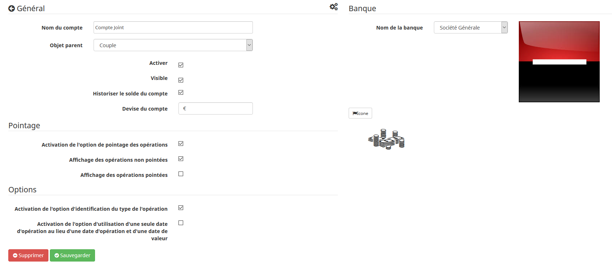

Pour le moment, vous pouvez paramétrer les éléments suivants: 

- Nom du compte

- Objet parent
Je conseille de créer par exemple un objet par personne et de rattacher les diffénts comptes à l'objet de la personne à qui il appartient. 

- Activer
Permet d'activer le compte et le rendre accessible dans le panel comptes

- Visible
Permet de rendre visible le compte sur le dashboard

- Historiser le solde du compte
Permet de générer une fois par jour l'historique du solde du compte dans l'historique Jeedom.

- Devise
Permet d'indiquer la devise du compte : est utilisée dans le panel et dans le widget

- Affichage des opérations non pointées
Configuration par défaut pour l'affichage du panel compte: possibilité d'afficher ou non les opérations non pointées.

- Affichage des opérations pointées
Configuration par défaut pour l'affichage du panel compte: possibilité d'afficher ou non les opérations pointées.

- Option "Activation de l'option d'identification du type de l'opération" : Permet de typer une opération (chèque, carte, virement)

- Opiton "Activation de l'option d'utilisation d'une seule date d'opération au lieu d'une date d'opération et d'une date de valeur"

- Nom de la banque
Sur la partie droite, une menu déroulant, constitué des banques définies dans la page configuration du plugin, permet de sélectionner la banque. 
Une fois sélectionnée, le logo de la banque apparait. 

- Icone: permet de choisir un icone pour la banque: sera utilisé pour différencier le compte dans le panel comptes. 

Widget sur le dashboard
===========

Il permet d'afficher: 
- le solde réel du compte et entre parenthèse, les opérations à pointer (si l'option est activée)
- le solde à la fin du mois (si l'optin est activée):prenant en compte les opérations non ponitées à venir avant la fin du mois et les virements automatiques qui vont tomber avant la fin du mois.  

Panel Comptes
===========

Rendez vous dans le menu *Accueil &gt; Comptes* pour retrouver le panel, élément principal du plugin.

Voici un aperçu de l'accueil du panel: 
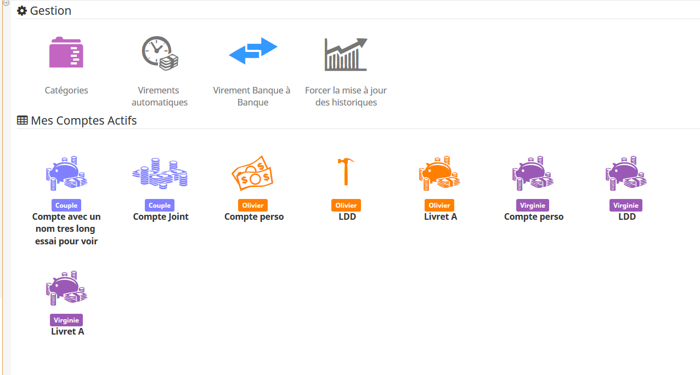

Deux parties se présentent: la partie Gestion et la partie Comptes actifs. 

Dans la partie Gestion, le bouton Forcer la mise à jour des historiques permet, comme son nom l'indique de lancer la mise à jour sans attendre la mise à jour quotidienne. 

La suite des fonctionnalités sont décrites ci-après.

Gestion des catégories
-----------
Cette page permet de gérer la liste des catégories des opérations bancaires. 
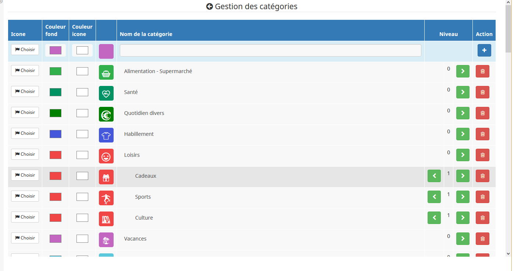

Elle permet de pouvoir créer des catégories et de "créer" une icône pour cette catégorie. Pour cela, vous pouvez choisir une icône via les icône de Jeedom et celles qui ont été ajoutées par le plugin, cela permet de couvrir un large choix. 
Après avoir choisi l'icône, vous pouvez choisir le couleur d'arrière plan et celle de l'image. 
Pour finir, il faut donner un nom et un niveau à la catégorie. Le niveau permet de créer des sous catégories. 

Afin de réorganiser les catégories, il faut les déplacer par "glisser" avec le curseur. 

Pour l'édition, elle est dynamique donc vous pouvez modifier les champs directement ça sera mis à jour une fois que vous changez de champ. 

Gestion des opérations bancaires
-----------
Une fois un compte sélectionné, on aperçoit sur la partie droite l'ensemble des opérations du compte. 

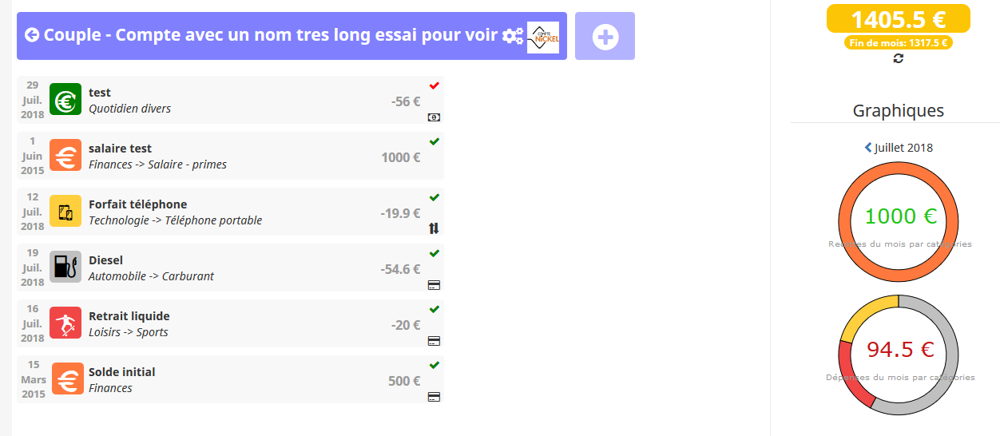

Dans l'exemple ci-dessus, on observe 7 opérations. 6 pointées et 1 non pointée. Vous remarquez que le solde réel et le solde "à pointer" sont dépendant des opérations pointées ou non. 
Ce distingo permet de pouvoir suivre, au jour le jour, les opérations effectuées avec vos moyens de paiement en les ajoutant dans le compte.
Lorsque l'opération est finalement visible sur votre compte bancaire (site internet de votre banque), vous pouvez le "pointer" en cliquant sur la flêche rouge. 
N'oubliez pas de mettre à jour la date de valeur.

Pour ajouter une opération, il faut renseigner l'ensemble des informations requises quand on clique sur le gros "+", puis appuyez sur "Entrée" ou cliquer sur le bouton "Ajouter l'opération". 

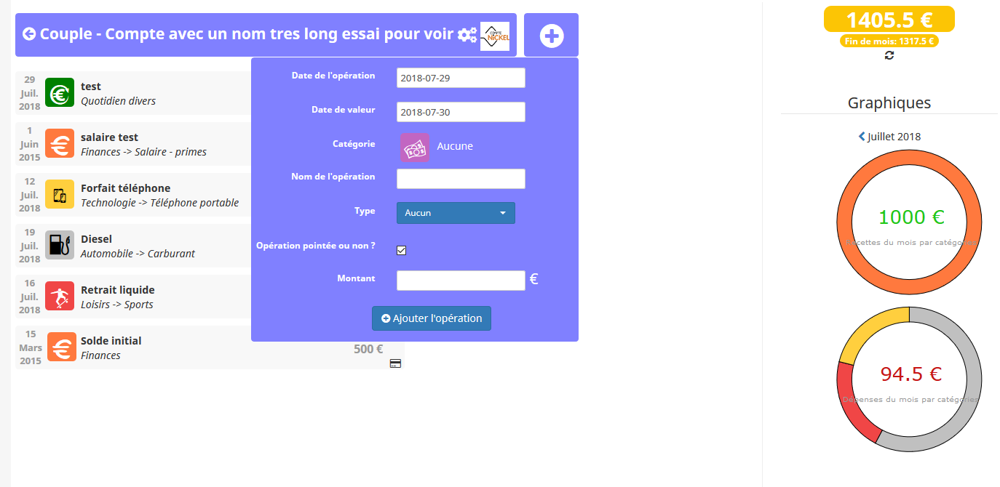

Que ce soit en ajout ou en édition, lorsque vous cliquez sur l'icône de la catégorie, un modal s'affiche permettant de choisir la catégorie: 

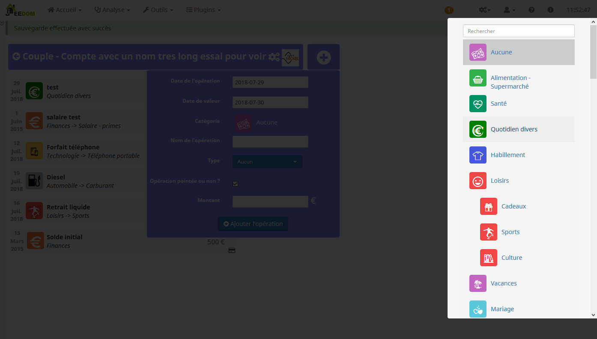

Pour éditer une opération, il faut cliquer dessus, un modal s'affiche en dessous pour l'édition des champs: 

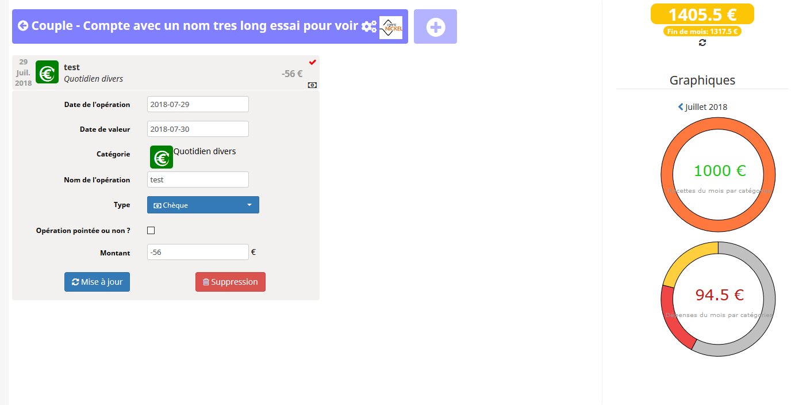

Gestion des virements/prélèvements automatiques
-----------
Une fois ce bouton cliqué, l'écran suivant permet d'ajouter/modifier des virements automatiques: 

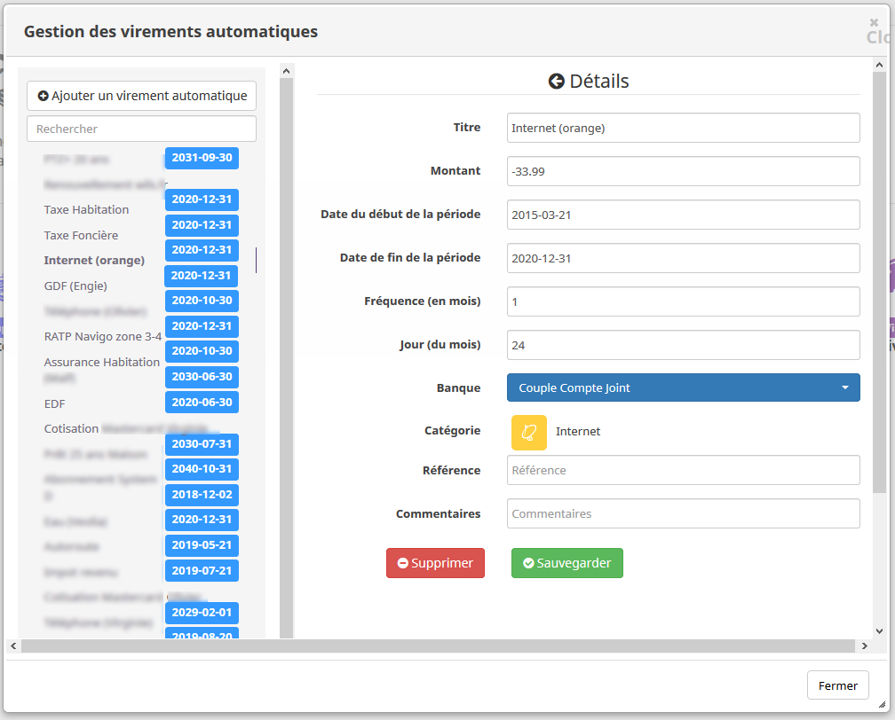

Les différents champs sont assez explicites. L'interêt est de ne pas avoir à ajouter manuellement ces opérations. Cela permet également qu'elles soient déjà prises en compte dans le calcul du "Fin de mois" afin de pouvoir mieux estimer la marge avant la fin de mois en prenant en compte tout ce qui va arriver. 

Gestion des transferts comptes à compte
-----------

Cette dernière page permet de faire un virement entre deux banques dans le plugin. Cela évite d'avoir à rentrer deux fois la même opération, on la rentre une seule fois et elle sera ajouté à chaque compte. 

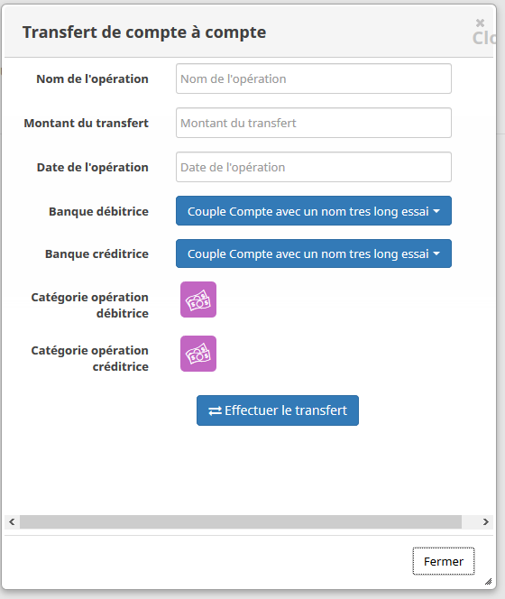
